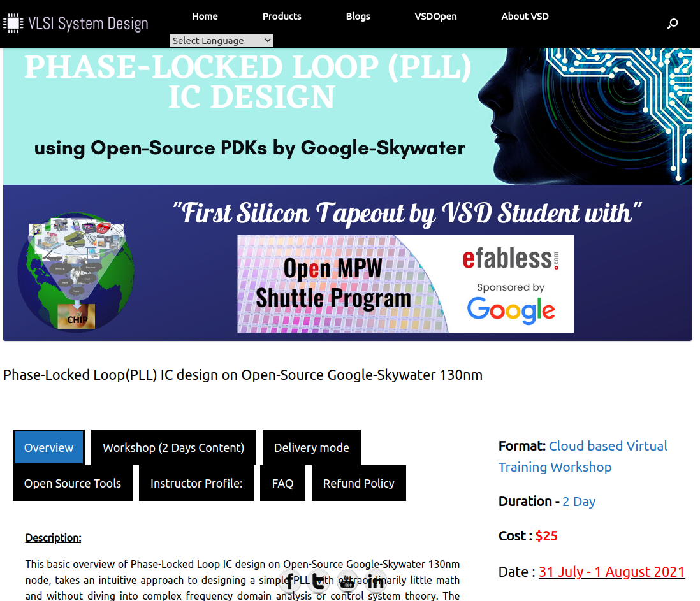
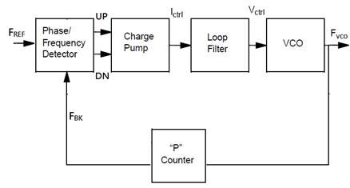
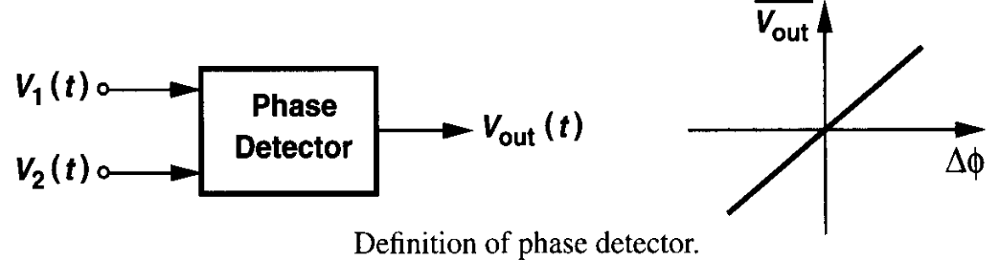
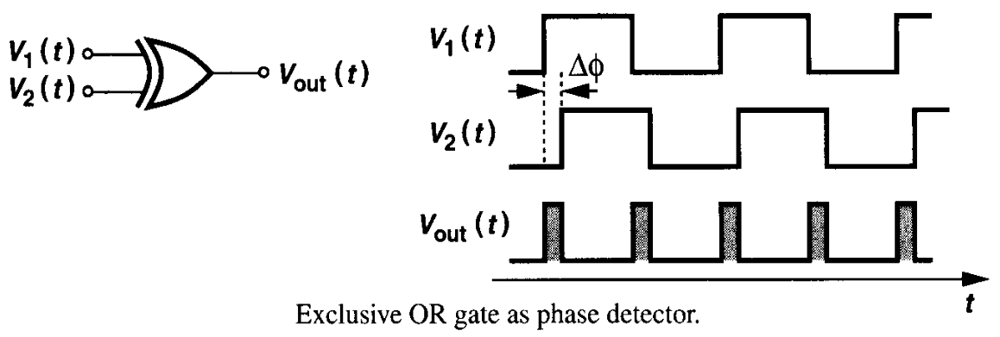
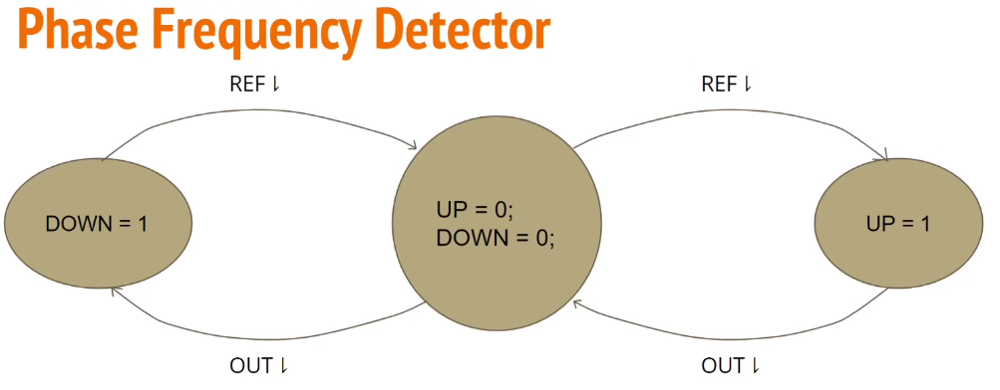
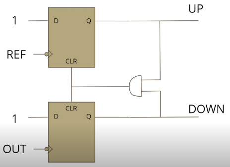
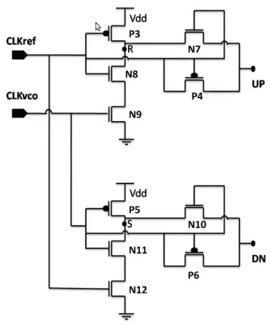
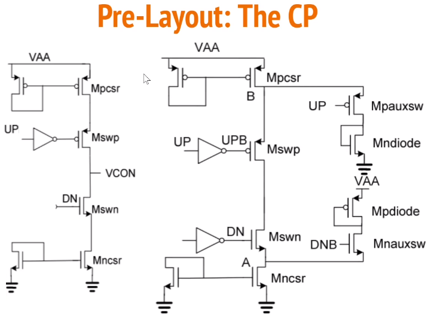
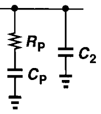

# Journal of 2-day Training Workshop on IC Design of Phase-Locked Loop (PLL) using Google SkyWater 130nm

The Phase-Locked Loop (PLL) is one of the most essential analog block in any integrated circuit circuit employing a (reasonably) high frequency clock signal such as a microprocessor. On-chip oscillators such as ring oscillators built by connecting an odd number of inverters in series and in feedback does provide a clock signal of frequency 1/(2*n*d), where n is the number (odd) of inverters in the ring and d is the delay of each inverter. However such a clock signal has too much phase noise or jitter and is almost unusable for high speed synchronous digital design. On the other hand, crystal oscillators have extemely high spectral purity i.e., low phase noise but they are available only to generate a specific set of frequencies such as 32 kHz, 383 kHz etc. which have specific applications. However, we would like to be able to generate a clock signal of arbitrary frequency but with a spectral purity comparable to that of a crystal oscillator. The PLL comes in this context. The PLL is essentially a feedback control system which dynamically adjusts the phase of the on-chip oscillator (typically a voltage controlled ring oscillator) by comparing its output with a reference signal typically the crystal oscillator. Since the I/O pads of an IC typically has very large capacitance, the frequency of the crystal oscillator connected to the input of the IC has a small frequency while the output of the PLL will be a multiple of the input crystal frequency. This 'frequency multiplication' is achieved by employing a frequency divider in the feedback path of the PLL.

## Block Diagram of PLL

The block diagram of the PLL shown above consists of the following blocks:
1. Phase (or Phase-Frequency) Detector
2. Charge Pump
3. Loop filter
4. Voltage Controlled Oscillator
5. Optionally, a frequency divider

### Phase (or Phase-Frequency) Detector
The first and important block of the PLL is a phase detector which compares the phases of the reference signal (typically a crystal) and the output of the VCO (or that of the frequency divider) and gives out an output voltage whose average value must be proportional to the phase difference between the two signals compared. This is illustrated in the figure below.

It is easy to see that a simple XOR gate can perform this function as shown in the figure below, but it is easy to see that an XOR gate will not be able to distinguish whether the output signal lags the reference signal or leads it.

Therefore, an improved version typically called a Phase-Frequency detector is designed based on the following finite-state machine. Here, the 'UP' signal means that the output frequency must be increased while the 'DOWN' signal means that the output frequency must be reduced.

The state transitions in the FSM are seen to happen at the falling edges of the reference and output signals. Therefore, this idea can be implemented by using two falling edge-triggered D FF's as shown below.

Since this circuit has the limitation of finite dead zone, very small phase differences between the reference and output signals will be missed by this circuit. As a result, the following improvised circuit is used for phase detection.

### Charge Pump
Charge pump is the second block in the PLL which takes the UP and DOWN output of the phase detector and generates an output voltage proportional to the difference between the ON-times of the UP and DOWN signals. When the UP signal is HIGH, current must flow into the output node increasing the output voltage. When the DOWN signal is HIGH, current must flow from the output node to ground, decreasing the output voltage. A schematic of the circuit that accomplishes this is shown below.

### Loop filter
The loop filter essentially smoothens the output of the charge pump so that the VCO output does not fluctuate too much. Typically a second-order filter as shown below is used. In order to simplify the conditions to stabilize the loop, C2 is typically chosen to be one-fifth to one-tenth of Cp.

### Voltage Controlled Oscillator (VCO)

### Frequency Divider

## Pre-Layout Simulation

## Layout

## Post-Layout Simulation

## System on-Chip as carrier for PLL

