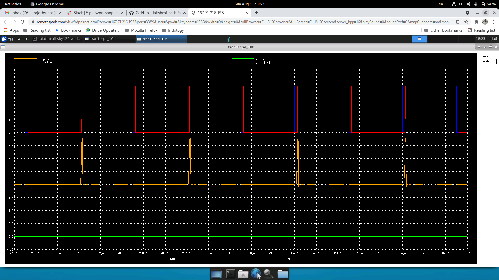
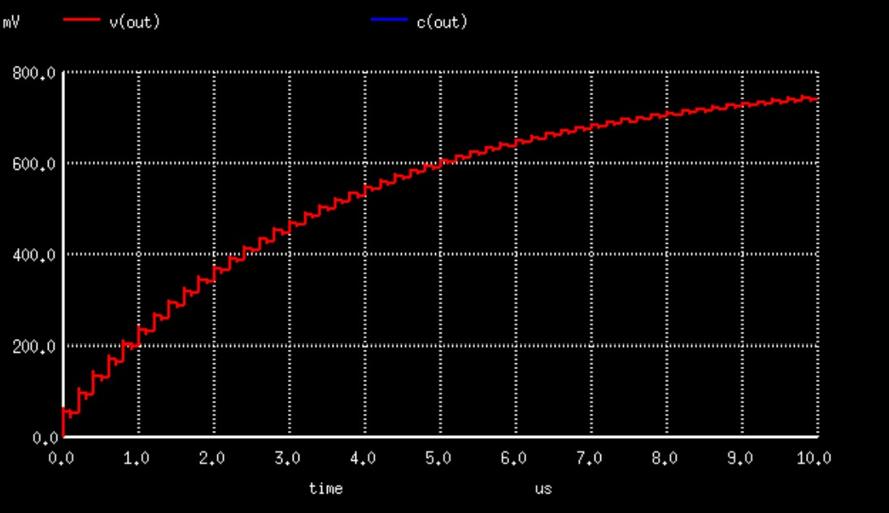
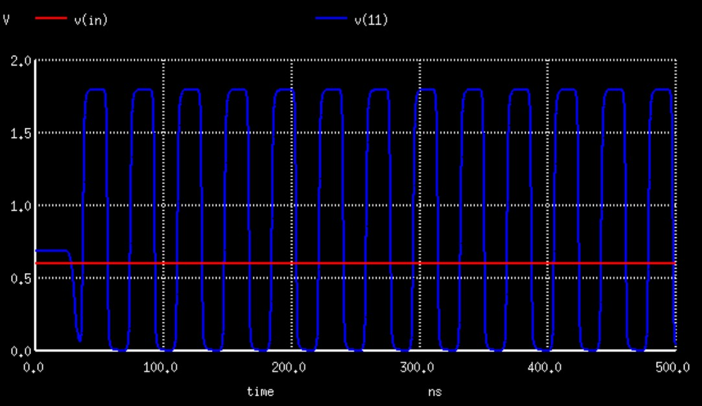
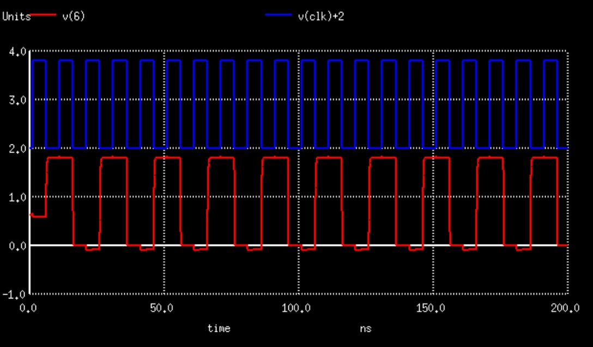
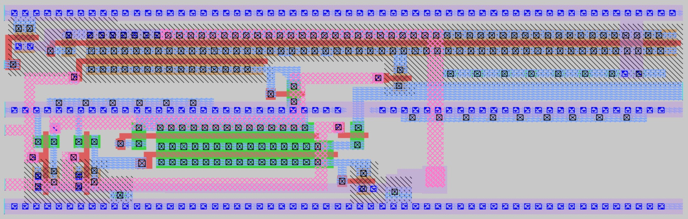
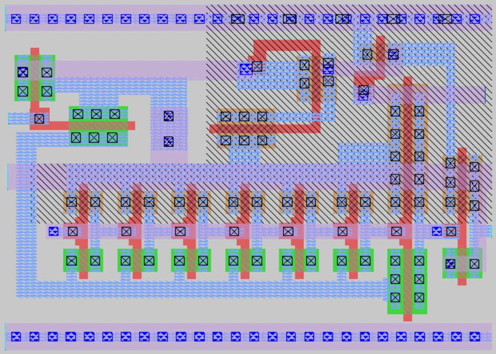
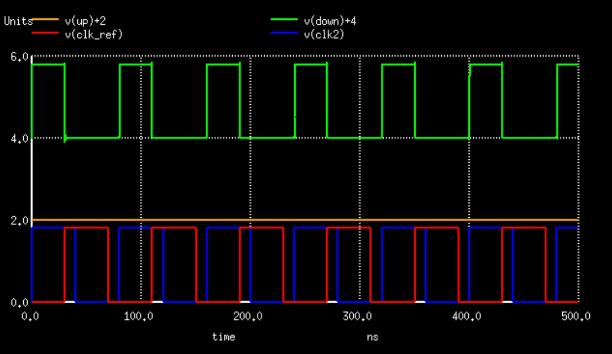
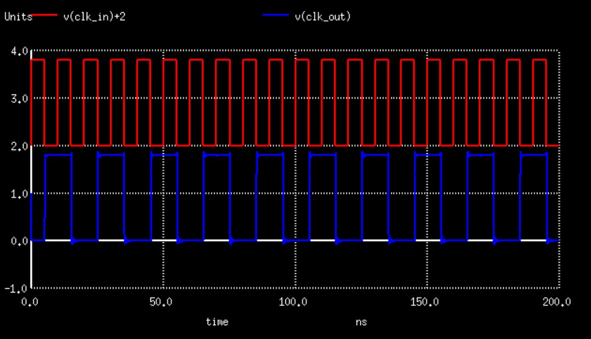

# Journal of 2-day Training Workshop on IC Design of Phase-Locked Loop (PLL) using Google SkyWater 130nm

The Phase-Locked Loop (PLL) is one of the most essential analog block in any integrated circuit circuit employing a (reasonably) high frequency clock signal such as a microprocessor. On-chip oscillators such as ring oscillators built by connecting an odd number of inverters in series and in feedback does provide a clock signal of frequency 1/(2*n*d), where n is the number (odd) of inverters in the ring and d is the delay of each inverter. However such a clock signal has too much phase noise or jitter and is almost unusable for high speed synchronous digital design. On the other hand, crystal oscillators have extemely high spectral purity i.e., low phase noise but they are available only to generate a specific set of frequencies such as 32 kHz, 383 kHz etc. which have specific applications. However, we would like to be able to generate a clock signal of arbitrary frequency but with a spectral purity comparable to that of a crystal oscillator. The PLL comes in this context. The PLL is essentially a feedback control system which dynamically adjusts the phase of the on-chip oscillator (typically a voltage controlled ring oscillator) by comparing its output with a reference signal typically the crystal oscillator. Since the I/O pads of an IC typically has very large capacitance, the frequency of the crystal oscillator connected to the input of the IC has a small frequency while the output of the PLL will be a multiple of the input crystal frequency. This 'frequency multiplication' is achieved by employing a frequency divider in the feedback path of the PLL.

## Block Diagram of PLL

The block diagram of the PLL shown above consists of the following blocks:
1. Phase (or Phase-Frequency) Detector
2. Charge Pump
3. Loop filter
4. Voltage Controlled Oscillator
5. Optionally, a frequency divider

### Phase (or Phase-Frequency) Detector
The first and important block of the PLL is a phase detector which compares the phases of the reference signal (typically a crystal) and the output of the VCO (or that of the frequency divider) and gives out an output voltage whose average value must be proportional to the phase difference between the two signals compared. This is illustrated in the figure below.

It is easy to see that a simple XOR gate can perform this function as shown in the figure below, but it is easy to see that an XOR gate will not be able to distinguish whether the output signal lags the reference signal or leads it.

Therefore, an improved version typically called a Phase-Frequency detector is designed based on the following finite-state machine. Here, the 'UP' signal means that the output frequency must be increased while the 'DOWN' signal means that the output frequency must be reduced.

The state transitions in the FSM are seen to happen at the falling edges of the reference and output signals. Therefore, this idea can be implemented by using two falling edge-triggered D FF's as shown below.

Since this circuit has the limitation of finite dead zone, very small phase differences between the reference and output signals will be missed by this circuit. As a result, the following improvised circuit is used for phase detection.

### Charge Pump
Charge pump is the second block in the PLL which takes the UP and DOWN output of the phase detector and generates an output voltage proportional to the difference between the ON-times of the UP and DOWN signals. When the UP signal is HIGH, current must flow into the output node increasing the output voltage. When the DOWN signal is HIGH, current must flow from the output node to ground, decreasing the output voltage. A schematic of the circuit that accomplishes this is shown below.

### Loop filter
The loop filter essentially smoothens the output of the charge pump so that the VCO output does not fluctuate too much. Typically a second-order filter as shown below is used. In order to simplify the conditions to stabilize the loop, C2 is typically chosen to be one-fifth to one-tenth of Cp.

### Voltage Controlled Oscillator (VCO)
The voltage controlled oscillator (VCO) consists of an odd-number of 'current-starved' inverters connected in a ring, as shown below. The output voltage of the loop filter is connected to the VCO with the output voltage controlling the current of each of inverter thereby controlling the delay of each inverter; therefore changing the frequency of the output signal of the VCO.

### Frequency Divider
A simple counter can function as a frequency divider. But here the following simple circuit is used to implement a frequency divider.

## Pre-Layout Simulation
For simulation of the circuits using ngspice, the netlist of the schematic needs to be written. Here is a snippet of the netlist of the phase-frequency detector circuit. The file is edited so as to make the phase difference between the reference signal and the frequency divider output signal to be 0.25ns.

The ngspice is invoked at the command prompt as shown below:

The result of this simulation is shown in the following plot. It can be noted that due to the small phase difference between the clock signals being compared, the UP signal is very narrow and DOWN signal is always LOW.

The simulation results of the other blocks of the PLL are as follows:
### Charge pump
Even though transistors in the lower technology nodes are nominally turned off, still they allow a very small current to pass through them, called leakage current. Here we simulate the output voltage of the charge pump when both the input signals UP and DOWN are LOW. The total voltage due to leakage is found to be 40 uV for a duration of 1 us.

Similarly, here are the simulation results when the UP signal is always HIGH and the DOWN signal is always LOW:

### Phase-frequency detector
The phase-frequency detector output when the reference signal leads the frequency divider output is shown below. The UP signal is seen to be HIGH for the duration when there is phase mismatch while the DOWN signal is always LOW.

### VCO
The VCO output is found to have a period of oscillation of about 40 ns when the control voltage is 0.6 V.

### Frequency divider
The frequency divider simulation result is obtained as follows. Clearly, the output is seen to be at half the frequency of the input.

In a similar manner, the different blocks of the PLL are constructed and the final simulation is run using the model file in TT corner. The simulation results thus obtained is shown below.

## Layout
The layouts of the building blocks of the PLL are constructed using magic tool. The snapshots of the various building blocks of the PLL are as follows:
### Phase-frequency detector

### Charge pump

### VCO

### Frequency divider

### Multiplexer 
The multiplexer comes in handy while testing the PLL. Either the output of the VCO could be given or an independent clock signal can be given for testing purposes.

The overall layout of the PLL looks thus:

## Post-Layout Simulation
Once the layouts are ready in magic, we can extract the parasitic resistances and capacitances. The following are the commands to be typed in the magic konsole interface:
extract cthresh 0 rthresh 0 // this command set the threshold values of R and C to be extracted as zero, so that any finite R and C is reflected in the extraction
ext2spice                   // this command converts the extracted netlist into spice format so that it can be simulated using ngspice
We need to make sure that the scale factor is correctly set in the file which has the parasitics extracted.
Once this spice file is ready, we can proceed to perform post-layout simulation using ngspice by invoking it at a terminal as done previously.

The post-layout simulations of the different blocks are as follows:
### Phase-frequency detector
When the output clock signal lags the reference signal:

### VCO
For a control voltage of 0.6 V, the time period of the VCO output is about 180 ns.

### Frequency divider

### Complete PLL

## System on-Chip Template as carrier for PLL
eFabless has come up with an SoC (System on-Chip) template, called Caravel, which acts as a carrier for the PLL thus designed. The block diagram of the Caravel SoC is shown below. The light pink area on the SoC is the location where we can instantiate our PLL layout. A screenshot of the PLL placed inside the Caravel is also shown.

